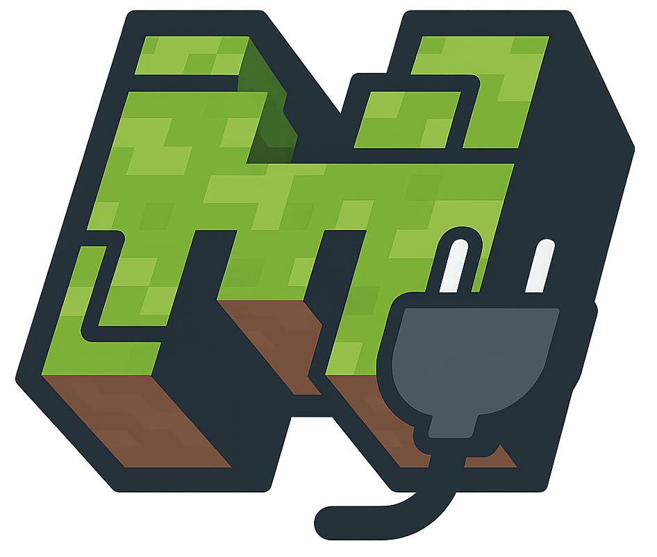

<p align="center">
  
</p>
<h1 align="center">Minecraft Server Plugins</h1>
<p align="center">
  <b>A collection of open-source Minecraft server plugins.</b><br>
  <b>Various enhancements for gameplay, administration, and server features.</b>
</p>
<p align="center">
  <a href="https://github.com/BerndHagen/Minecraft-Server-Plugins/releases"></a>&nbsp;&nbsp;<a href="https://github.com/BerndHagen/Minecraft-Server-Plugins/blob/main/LICENSE"></a>&nbsp;&nbsp;&nbsp;&nbsp;&nbsp;&nbsp;&nbsp;&nbsp;&nbsp;&nbsp;<a href="https://github.com/BerndHagen/Minecraft-Server-Plugins/issues"></a>
</p>

This collection provides **open-source Minecraft plugins** designed to add functionality to server gameplay. Originally developed for an own Minecraft server to enhance industrial automation, area protection, and backup capabilities, these plugins are now shared with the community to benefit other server administrators.

Each plugin is built with performance in mind and offers extensive configuration options for server administrators. Whether you're running a survival server, creative server, or custom game mode, these plugins provide additional features for your server. All plugins are released under the **MIT License**, allowing complete freedom to modify, distribute, and integrate them into your server environment.

### **Plugin Overview**

- **Advanced Achievements:** Comprehensive achievement system with custom rewards, progress tracking, and database integration
- **Area Rewind:** Advanced area protection and backup system with undo/redo functionality, automatic backups, and GUI management
- **Grappling Hook:** Transforms fishing rods into grappling hooks with configurable range, pull speed, and per-player settings
- **Map Revealer:** Automatically reveal entire maps with customizable color schemes and locking functionality
- **Piston Crusher:** Automated block crushing system using pistons with configurable materials and multipliers  
- **Power Mining:** Enhanced mining experience with mounted mining, magnet hoppers, ore scanner, escape ropes, and auto-smelting
- **Rail Boost:** Enhanced minecart system with speed control, auto-pickup, storage, and advanced transportation features
- **Super Enchantments:** Advanced enchantment system allowing enchantments beyond vanilla limits with level 1-255 support
- **Wireless Redstone:** Wirelessly link copper bulbs, redstone lamps, and containers that sync their states across any distance
- **Useful Autocrafter:** Protect autocrafter ingredient slots by preventing crafts that would consume a slot's last item
- **BloodMoon Event:** Nightly boss event that spawns seven distinct NPCs — Vampire, Clown, Zombie, Witch, Scarecrow, Ghost, and Werewolf — near active players with custom abilities, difficulty scaling, and configurable spawn rules

### **Key Features**

- **Open Source:** Complete source code available under MIT License for modification and improvement
- **Performance Optimized:** Efficient code designed for minimal server impact and smooth gameplay
- **Highly Configurable:** Extensive configuration options to customize behavior for your server needs
- **Database Integration:** Advanced data storage and player progress tracking capabilities
- **Modern API Support:** Built for Minecraft 1.21+ with backwards compatibility considerations
- **Admin Commands:** Comprehensive command systems for easy server management and configuration
- **GUI Interfaces:** User-friendly graphical interfaces for easy management and configuration

### **Supported Platforms**

These plugins are compatible with major Minecraft server platforms:

- **Server Software:** `Spigot`, `Paper`, `Purpur`, `CraftBukkit`
- **Minecraft Versions:** `1.21.5`, `1.21.6`, `1.21.7`, `1.21.8`, `1.21.9`, `1.21.10` (also compatible with higher versions)
- **Java Requirements:** `Java 17+`

### **Plugin Compatibility**

All plugins are designed to work seamlessly together and with popular server plugins:

- **Economy Integration:** Vault support for economy rewards and transactions
- **Permission Systems:** Compatible with LuckPerms, PermissionsEx, and other permission managers
- **WorldGuard Integration:** Respect region protections and building restrictions
- **Database Support:** MySQL, SQLite, and file-based storage options

## **Table of Contents**

1. [Getting Started](#getting-started)
    - [Prerequisites](#prerequisites)
    - [Installation Steps](#installation-steps)
    - [First Launch & Configuration](#first-launch--configuration)
    - [Verifying Installation](#verifying-installation)
2. [Advanced Achievements](#advanced-achievements)
    - [Core Features](#core-features)
    - [Administrative & Player Commands](#administrative--player-commands)
3. [Area Rewind](#area-rewind)
    - [Core Features](#core-features-1)
    - [Getting Started](#getting-started-1)
    - [Player Commands](#player-commands)
    - [Administrative Commands](#administrative-commands)
4. [Grappling Hook](#grappling-hook)
    - [Core Features](#core-features-2)
    - [Player Commands](#player-commands-1)
5. [Map Revealer](#map-revealer)
    - [Core Features](#core-features-3)
    - [Player Commands](#player-commands-2)
6. [Piston Crusher](#piston-crusher)
    - [Core Features](#core-features-4)
    - [Example Setup](#example-setup)
    - [Administrative Commands](#administrative-commands-1)
7. [Power Mining](#power-mining)
    - [Core Features](#core-features-5)
    - [Player Commands](#player-commands-3)
8. [Rail Boost](#rail-boost)
    - [Core Features](#core-features-6)
    - [Player Commands](#player-commands-4)
9. [Super Enchantments](#super-enchantments)
    - [Core Features](#core-features-7)
    - [Custom Enchantments](#custom-enchantments)
    - [Enchantment Compatibility](#enchantment-compatibility)
    - [Player Commands](#player-commands-5)
    - [Usage Examples](#usage-examples)
10. [Wireless Redstone](#wireless-redstone)
    - [Core Features](#core-features-8)
    - [Player Commands](#player-commands-6)
    - [Bulb & Container Variants](#bulb--container-variants)
11. [Useful Autocrafter](#useful-autocrafter)
    - [Core Features](#core-features-9)
    - [Player Commands](#player-commands-7)
12. [NPC Item Pickup and Drop](#npc-item-pickup-and-drop)
    - [Core Features](#core-features-10)
    - [Administrative Commands](#administrative-commands-2)
    - [Usage Examples](#usage-examples-1)
13. [BloodMoon Event](#bloodmoon-event)
    - [Core Features](#core-features-11)
    - [Administrative Commands](#administrative-commands-3)
    - [Usage Examples](#usage-examples-2)
14. [License](#license)
15. [Screenshots](#screenshots)

## **Getting Started**

### **Prerequisites**
- Minecraft server 1.21 or higher (Spigot, Paper, or compatible fork)
- Java 17 or newer (Java 21 recommended)
- (Optional) Vault for economy features, LuckPerms or PermissionsEx for permissions, MySQL for advanced database support

### **Installation Steps**
1. Download the latest plugin `.jar` files from the [Releases](https://github.com/BerndHagen/Minecraft-Server-Plugins/releases) page.
2. Stop your Minecraft server if it is running.
3. Copy the downloaded `.jar` files into your server's `plugins` folder.
4. (Optional) Add Vault, LuckPerms, or other dependencies to the `plugins` folder if needed.
5. Start your server again.

### **First Launch & Configuration**
- On first start, each plugin will generate its own configuration files in the `plugins/PluginName/` directory.
- Edit these config files as needed, or use in-game commands for setup (see plugin sections below).

### **Verifying Installation**
- Use `/plugins` in-game to check if the plugins are loaded and active.
- Use `/version <PluginName>` to check the version and status of each plugin.
- If a plugin does not load, check the server console for error messages (e.g., missing dependencies or wrong Java version).

For plugin-specific commands and advanced configuration, see the sections below.

## **Advanced Achievements**

Advanced Achievements is an open-source Minecraft plugin that provides a fully configurable achievement system for Spigot and Paper servers. The plugin ships with 30 predefined achievements out of the box and tracks player progress across 19 task types, including combat, building, smelting, movement, and playtime-based goals. Every achievement is independently configurable with its own title, description, GUI icon, task target, required count, reward list, hidden flag, and prerequisite chain. Progress and claim state are persisted per player in either SQLite or MySQL, and the entire system is designed to be extended by server developers through a built-in Java API.

### Core Features:
- **30 Predefined Achievements:** Full starter progression set with combat, utility, exploration, economy, and endgame milestones
- **19 Task Types:** Tracks block break/place, item pickup/crafting/smelting, mob and player kills, damage dealt/taken, fishing, eating, enchanting, trading, mining, breeding, taming, death, walk distance, and play time
- **Reward System:** Supports items, XP, economy money via Vault, console commands with placeholders, and title rewards
- **Achievement Prerequisites:** Build multi-step progression chains by requiring earlier achievements first
- **Hidden Achievements:** Keep entries hidden until players unlock them
- **Interactive GUI:** Paginated inventory browser with progress bars, claim states, and click-to-claim rewards
- **Chat Creation Wizard:** Create achievements interactively in chat without editing YAML manually
- **Database Integration:** SQLite and MySQL support with asynchronous persistence
- **Broadcast Notifications:** Unlocks can trigger title, chat, and optional global broadcast messages
- **Sound and Firework Effects:** Unlock feedback is configurable per server
- **Progress Bar Display:** Optional ActionBar or BossBar progress display
- **Developer API:** Java API for creating achievements, querying progress, unlocking rewards, and adding progress programmatically

### Administrative & Player Commands:

| Command | Description |
|---------|-------------|
| `/ach` | Open the paginated achievement list |
| `/ach list <page>` | View visible achievements with pagination |
| `/ach info <id>` | Show full details for a specific achievement |
| `/ach progress <id>` | Show current progress for a specific achievement |
| `/ach stats` | Show unlock count and completion percentage |
| `/ach gui` | Open the inventory-based achievement browser |
| `/ach create` | Start the interactive achievement creation wizard |
| `/ach reload` | Reload `config.yml`, `achievements.yml`, and `messages.yml` |

**Aliases:** `/achievementadmin`, `/achadmin`, `/ach`

## **Area Rewind**

A comprehensive area protection and backup system that allows players to create protected zones with automatic backups, undo/redo functionality, and advanced visualization features. Perfect for servers that need reliable area management with rollback capabilities.

### Core Features:
- **Enhanced GUI System:** Comprehensive graphical interface with main menu, area management with creation wizard, advanced backup management with visual timeline, permission and trust management interfaces, visualization controls, and administrative tools
- **Area Protection:** Create protected areas with position selection using wooden hoe tool
- **Automatic Backups:** Scheduled backups with configurable intervals and retention policies
- **Manual Backups:** Create backups on demand for important moments
- **Undo/Redo System:** Full undo/redo functionality for area changes with history tracking
- **Advanced Restoration:** Restore areas to any previous backup state with preview functionality and time-based rollback
- **Permission System:** Owner and trusted player system with granular permissions
- **Visualization:** Particle-based area boundary visualization with customizable effects
- **Import/Export:** Export and import area data for portability, including WorldEdit schematic export
- **WorldEdit Integration:** Enhanced functionality if WorldEdit is present
- **Block State Support:** Full support for containers with contents (chests, barrels, etc.), signs with text, banners with patterns, and all complex block states
- **Database Storage:** Persistent storage with file-based backup system
- **Custom Icons:** Set custom icons for areas and backups
- **Interval Management:** Automatic backup intervals and restoration scheduling
- **Change Detection:** Scan for changes since last backup with comparison tools

### Getting Started:
1. **Selection:** Use a wooden hoe to select two corners of your area (left-click pos1, right-click pos2)
2. **Creation:** Use `/rewind save <name>` to create a protected area
3. **Backup:** Use `/rewind backup <area>` to create manual backups
4. **Management:** Use `/rewind gui` for easy graphical management

### Player Commands:

| Command | Description |
|---------|-------------|
| `/rewind` | Open the AreaRewind management GUI |
| `/rewind tool` | Get the area selection tool (wooden hoe) |
| `/rewind pos1` | Set position 1 to block you're looking at |
| `/rewind pos2` | Set position 2 to block you're looking at |
| `/rewind save <name>` | Create protected area with current selection |
| `/rewind list [owned/trusted/all]` | List protected areas with filtering |
| `/rewind info <area>` | Show detailed information about an area |
| `/rewind teleport <area>` | Teleport to the center of an area |
| `/rewind backup <area>` | Create manual backup of an area |
| `/rewind restore <area> <backup_id/latest/oldest>` | Restore area from backup |
| `/rewind undo <area>` | Undo last change to area |
| `/rewind history <area> [page]` | View backup history with pagination |
| `/rewind rollback <area> <time>` | Rollback to specific time (e.g., 2h, 30m, 1d) |
| `/rewind preview <area> [backup_id] [particle_type]` | Preview backup with particles |
| `/rewind show <area>` | Visualize area boundaries |
| `/rewind hide [area]` | Hide area visualization |
| `/rewind trust <area> <player>` | Add trusted player to area |
| `/rewind untrust <area> <player>` | Remove trusted player from area |
| `/rewind export` | Export area's latest backup to WorldEdit .schem file |

### Administrative Commands:

| Command | Description |
|---------|-------------|
| `/rewind reload` | Reload plugin configuration |
| `/rewind delete <area>` | Delete area and all its backups |
| `/rewind rename <old_name> <new_name>` | Rename an area |
| `/rewind expand <area> <direction> <amount>` | Expand area in specified direction |
| `/rewind contract <area> <direction> <amount>` | Shrink area in specified direction |
| `/rewind permission <add/remove/list> <area> [player]` | Manage area permissions |
| `/rewind seticon <area> <material>` | Set custom icon for area |
| `/rewind seticon backup <area> <backup_id> <material>` | Set custom icon for specific backup |
| `/rewind cleanup <area> [days]` | Clean up old backups (default: 7 days) |
| `/rewind scan <area>` | Scan for changes since last backup |
| `/rewind diff <area> <id1> <id2>` | Compare two backups and show differences |
| `/rewind interval <set/remove/check> <area> [minutes] [backup_id]` | Manage automatic backup intervals |
| `/rewind restoreblock <area> <backup_id/latest/oldest> [world]` | Restore area from backup (for command blocks and console) |
| `/rewind status` | Show system status and statistics |
| `/rewind help` | Show help information |

**Aliases:** `/ar`, `/arearewind`  
**Tool:** Wooden Hoe for area selection  
**Command Aliases:** Most commands support shortened versions (e.g., `perm` for `permission`, `tp` for `teleport`, `compare` for `diff`)

## **Grappling Hook**

A fun utility plugin that transforms fishing rods into grappling hooks! Players can launch hooks that pull them towards the landing location, with fully customizable settings for range, speed, and visual effects.

### Core Features:
- **Toggle System:** Players can enable/disable the grappling hook feature individually
- **Fully Customizable:** Each player can configure all grappling hook parameters
- **Extended Range:** Hooks travel further than normal fishing rods (configurable 10-100 blocks)
- **Pull Mechanics:** Players are pulled to where the hook lands with adjustable speed
- **Per-Player Configuration:** All settings are saved per-player and persist through sessions
- **Sound & Particle Effects:** Visual and audio feedback that can be toggled per-player
- **Vertical Boost:** Configurable upward momentum when being pulled
- **Reset Command:** Restore all settings to server defaults instantly

### Player Commands:

| Command | Description |
|---------|-------------|
| `/grapplinghook` | Toggle the grappling hook on/off |
| `/grapplinghook toggle` | Toggle the grappling hook on/off |
| `/grapplinghook range <value>` | Set your hook range (10-100 blocks) |
| `/grapplinghook speed <value>` | Set pull speed (how fast you're pulled) |
| `/grapplinghook boost <value>` | Set vertical boost (upward momentum) |
| `/grapplinghook velocity <value>` | Set hook throw velocity |
| `/grapplinghook sound` | Toggle sound effects on/off |
| `/grapplinghook particles` | Toggle particle effects on/off |
| `/grapplinghook reset` | Reset all settings to server defaults |
| `/grapplinghook info` | View your current settings |

**Aliases:** `/hook`, `/grapple`, `/hookshot`  
**Requirements:** Hold a fishing rod and right-click to launch the hook

## **Map Revealer**

A utility plugin that allows players to instantly reveal entire maps without having to explore every chunk. Features multiple color schemes for thematic map appearances and automatic map locking to preserve custom reveals.

### Core Features:
- **Instant Map Reveal:** Completely reveal any map in your hand with a single command
- **Color Schemes:** 9 different color schemes including withered, ender, mystic, nether, sepia, grayscale, inverted, ocean, and autumn
- **Depth Rendering:** Optional Y-level rendering for cave maps or surface-only reveals
- **Map Locking:** Automatically locks maps with custom schemes to prevent Minecraft's automatic updates from overwriting them
- **Performance Optimized:** Asynchronous processing to avoid server lag during large map reveals

### Player Commands:

| Command | Description |
|---------|-------------|
| `/revealmap` | Reveal the map in your hand (surface, normal colors) |
| `/revealmap [depth]` | Reveal at specific Y level (e.g., 64 for sea level) |
| `/revealmap [depth] [scheme]` | Reveal with custom color scheme (e.g., withered, ender) |
| `/revealmap lock` | Lock the map to prevent automatic updates |
| `/revealmap schemes` | List all available color schemes |
| `/revealmap help` | Show help information |

**Aliases:** `/mapreveal`, `/mr`  
**Examples:**  
- `/revealmap` - Basic surface reveal  
- `/revealmap 64 withered` - Reveal caves at Y=64 with withered colors  
- `/revealmap nether` - Surface reveal with nether color scheme  

## **Piston Crusher**

An automation plugin that allows pistons to crush only whitelisted blocks into multiple items, with a configurable multiplier. All settings can be changed live via command, no server restart required.

### Core Features:
- **Block Whitelist:** Only allowed blocks are crushed (configurable)
- **Output Multiplier:** Sets how many items are dropped per block
- **Crusher Block:** Must be movable by pistons (e.g., no obsidian, bedrock, etc.)
- **Tab Completion:** Available for all material names

### Example Setup

To build a working piston crusher, arrange the blocks in a straight line as follows:

```
[Piston] [Block to be crushed] [Crusher Block]
```

**How it works:**
- When the piston extends, it pushes the block to be crushed into the crusher block
- If the block to be crushed is on the whitelist, it will be destroyed and drop multiplied items according to the plugin settings
- The piston must be facing directly toward the block to be crushed, which is then directly adjacent to the crusher block

Make sure there is nothing blocking the piston from pushing the block into the crusher block. Only blocks on the whitelist will be crushed and multiplied.

### Administrative Commands:
| Command | Description |
|--------|--------------|
| `/pistoncrusher whitelist add <Material>` | Adds a block to the whitelist |
| `/pistoncrusher whitelist remove <Material>` | Removes a block from the whitelist |
| `/pistoncrusher whitelist list` | Shows all allowed blocks |
| `/pistoncrusher multiplier <Value>` | Sets the multiplier (e.g. 2.5) |
| `/pistoncrusher multiplier` | Shows the current multiplier |
| `/pistoncrusher crusherblock <Material>` | Sets the crusher block |
| `/pistoncrusher crusherblock` | Shows the current crusher block |

**Note:** Material names must be valid (`cobblestone`, `gold_block`, ...). Multiplier ≥ 1.0. Changes take effect immediately.

## **Power Mining**

A comprehensive mining enhancement plugin that adds powerful tools and features to improve the mining experience. From mounted mining while riding horses to magical ore-revealing goggles, this plugin transforms how players explore caves and gather resources.

### Core Features:
- **Mounted Mining (Drill):** Automatically mine a 3x3x3 area while riding horses, donkeys, or mules
- **Magnet Hopper:** Special hoppers that attract nearby dropped items like a magnet with configurable radius
- **Ore Scanner Bell:** Placeable bells that reveal all ores in a radius with glowing outlines when activated
- **Miner's Helmet:** Gold helmet that grants permanent night vision while worn
- **Escape Rope:** Magical leads that remember a location and teleport you back (single-use)
- **Cave Compass:** Mystical compass that points to nearby structures (dungeons, mineshafts, strongholds, etc.)
- **Smelter's Pickaxe:** Special pickaxe that auto-smelts ores when mining (Fortune compatible)
- **Miner's Goggles:** Leather helmet that reveals nearby ores with glowing outlines in real-time

### Player Commands:

| Command | Description |
|---------|-------------|
| `/pm magnethopper [player] [radius]` | Give a Magnet Hopper |
| `/pm orebell [player] [radius] [--filter ORE_TYPE] [--duration TICKS]` | Give an Ore Scanner Bell |
| `/pm helmet [player]` | Give a Miner's Helmet |
| `/pm escaperope [player]` | Give an Escape Rope |
| `/pm cavecompass [player]` | Give a Cave Compass |
| `/pm smelterpick [player]` | Give a Smelter's Pickaxe |
| `/pm goggles [player] [radius] [--filter ORE_TYPE]` | Give Miner's Goggles |
| `/pm drill` | Show mounted mining help |
| `/pm help` | Show all commands |

**Aliases:** `/powermining`, `/pm`  
**Ore Colors:** Diamond (Cyan), Emerald (Bright Green), Gold (Gold), Iron (Tan), Copper (Orange-Brown), Redstone (Red), Lapis (Blue), Coal (Dark Gray), Quartz (White), Ancient Debris (Brown)

## **Rail Boost**

Rail Boost is an open-source Minecraft plugin that transforms vanilla minecart transportation into a fully configurable, preset-driven system. Each minecart can be configured with six speed levels, automated item collection, optional particle and magnet effects, chunk loading behavior, and shared preset storage managed through named preset sticks. The plugin also adds rail safety checks and speed handling so minecarts travel more reliably across complex track networks.

### Core Features:
- **Speed Control:** Six configurable speed levels with enhanced curve handling, uphill momentum preservation, and smooth speed transitions
- **Auto-Pickup System:** Automatic item collection within a configurable radius with per-cart blacklist filtering
- **Preset-Linked Shared Storage:** Preset carts can use shared 54-slot storage inventories
- **Preset System:** Create, save, share, and apply named minecart configurations using preset sticks
- **Predefined Presets:** Ships with three standard presets for speed, collector, and magnet use cases
- **Advanced Physics:** Multi-block track checks, anti-stuck handling, and safer high-speed rail travel
- **Magnetism System:** Optional minecart attraction for train convoy behavior with collision prevention
- **Visual Effects:** Configurable particle trails with speed-based intensity
- **Real-Time Speedometer:** BossBar speed display in km/h with color-coded feedback
- **Chunk Loading:** Temporary chunk force-loading for uninterrupted long-distance travel
- **F-Key Access:** Open storage and hopper minecart inventories while seated
- **Persistent Configuration:** Preset and cart settings persist across restarts

### Player Commands:
| Command | Description |
|---------|-------------|
| `/railboost help` | Show command help |
| `/railboost preset <name>` | Give yourself a preset stick |
| `/railboost give <player> <preset>` | Give another player a preset stick |
| `/railboost create <name>` | Create a new preset |
| `/railboost edit <preset> <setting> <value>` | Edit one preset setting |
| `/railboost edit <preset> storage` | Open shared storage for a preset |
| `/railboost list` | List all available presets |
| `/railboost delete <preset>` | Delete a preset |

**Aliases:** `/rb`, `/boost`

## **Super Enchantments**

A comprehensive enchantment system that extends vanilla Minecraft enchanting capabilities by allowing all vanilla enchantments with levels 1-255, plus a collection of powerful custom enchantments with unique abilities. Each enchantment is carefully balanced with configurable cooldowns, effects, and compatibility checks.

### Core Features:
- **Enhanced Vanilla Enchanting:** Apply any vanilla enchantment with levels 1-255, breaking traditional level limits
- **Custom Enchantments:** 9 unique custom enchantments with special abilities and visual effects
- **Smart Compatibility:** Automatic item compatibility checking - only valid enchantments are suggested
- **Intelligent Tab Completion:** Context-aware suggestions showing only applicable enchantments for held items
- **Configurable System:** Extensive configuration options for cooldowns, damage, effects, and behavior
- **Cooldown Management:** Built-in cooldown system with optional display messages for custom enchantments
- **Persistent Storage:** Custom enchantments are stored using Minecraft's persistent data containers
- **Visual Feedback:** Particle effects, sounds, and visual indicators for enchantment activation

### Custom Enchantments:

#### **Combat Enchantments**
- **Arrow Storm** (Level 1-5): Right-click to fire multiple arrows with increased damage and speed. Higher levels reduce cooldown and spread while increasing arrow count
- **Blazing Shot** (Level 1-5): Launch fireballs that explode on impact. Advanced levels fire multiple projectiles with increased explosion power
- **Venom Strike** (Level 1-5): Chance to poison targets on hit with increasing duration and intensity based on enchantment level
- **Thunderbolt** (Level 1-5): Chance to strike enemies with lightning, with higher levels creating multiple strikes in a wider area
- **Frostbite** (Level 1-5): Freeze enemies on hit, applying slowness and mining fatigue effects that scale with level
- **Soul Drain** (Level 1-5): Life-steal enchantment that heals the player based on damage dealt, with healing scaling by level

#### **Utility Enchantments**
- **Void Step** (Level 1-3): Teleport forward through obstacles and terrain. Higher levels increase teleport distance and reduce cooldown
- **Pack Leader** (Level 1-3): Summon tamed wolves to fight alongside you. Level determines wolf count, duration, and combat effectiveness

### Enchantment Compatibility:
- **Weapon Enchantments:** Swords, axes, tridents, and some utility items
- **Tool Enchantments:** All vanilla tools plus special items like sticks and rods
- **Ranged Enchantments:** Bows, crossbows for projectile-based abilities
- **Special Items:** Custom enchantments can be applied to themed items (e.g., bones for Pack Leader, ender pearls for Void Step)

### Player Commands:
| Command | Description | Permission |
|---------|-------------|------------|
| `/superenchant <enchantment> [level]` | Apply vanilla enchantment (1-255) | `superenchantments.use` |
| `/superenchant customs <enchantment> [level]` | Apply custom enchantment | `superenchantments.use` |
| `/enchantlist` | Show available enchantments for held item | `superenchantments.list` |
| `/superenchant togglecooldown` | Toggle cooldown display messages (admin) | `superenchantments.admin` |

### Usage Examples:
```
/superenchant sharpness 100          # Apply Sharpness 100 to held weapon
/superenchant customs arrow_storm 3   # Apply Arrow Storm level 3
/superenchant efficiency 255          # Maximum vanilla efficiency
/enchantlist                         # See what can be enchanted
```

**Aliases:** `/senchant`, `/se` for `/superenchant` | `/elist`, `/el` for `/enchantlist`  
**Requirements:** Item must be held in main hand and be enchantable  
**Permissions:** Default permissions allow listing (`superenchantments.list: true`) but restrict usage to operators (`superenchantments.use: op`)

**Note:** Custom enchantments use a sophisticated trigger system that responds to different events (combat, interaction, projectile hits) and include built-in cooldowns to maintain game balance. All effects are configurable through the plugin's config.yml file.

## **Wireless Redstone**

A powerful plugin that enables players to create groups of wirelessly linked blocks that synchronize their states across any distance. Link copper bulbs, redstone lamps, chests, shulker boxes, and copper chests for seamless wireless automation and lighting systems.

### Core Features:
- **Wireless Bulbs & Lamps:** Create linked groups of copper bulbs or redstone lamps that sync their lit/unlit state (2-26 per group)
- **Wireless Containers:** Create linked groups of chests, shulker boxes, or copper chests that share inventory in real-time
- **Management GUI:** Visual interface to manage all wireless groups with category organization
- **Circuit Analyser:** Diagnostic tool for inspecting wireless blocks with WireView mode for color-coded outlines
- **Connector Tool:** Management tool for adding/removing blocks from groups with creation mode for new groups
- **Block Recovery:** Recover lost or broken wireless blocks that belong to existing groups
- **All Copper Variants:** Support for normal, exposed, weathered, and oxidized copper (plus waxed versions)
- **All Shulker Colors:** Support for all 17 shulker box colors
- **Hopper Compatible:** Wireless containers work seamlessly with hoppers for automation
- **Persistent Data:** All data saved automatically and survives server restarts

### Player Commands:

| Command | Description |
|---------|-------------|
| `/wireless bulbs [count] [variant]` | Get linked copper bulbs |
| `/wireless lamps [count]` | Get linked redstone lamps |
| `/wireless chests [count] [variant]` | Get linked containers |
| `/wireless append <group> [count]` | Add more blocks to existing group |
| `/wireless recover <group>` | Recover lost/missing blocks in group |
| `/wireless setname <group> <newName>` | Rename a group |
| `/wireless setcategory <group> <cat>` | Assign group to a category (or 'none') |
| `/wireless tool inspect [player]` | Get a Circuit Analyser diagnostic tool |
| `/wireless tool connector <group>` | Get a Connector Tool (creates group if new) |
| `/wireless gui [--all]` | Open category selection GUI |
| `/wireless debug on\|off` | Toggle sync debug messages |
| `/wireless reload` | Reload configuration files (admin only) |

### Bulb & Container Variants:

| Bulb Variants | Container Variants |
|---------------|-------------------|
| `--copper` (default) | `--chest` (default) |
| `--exposed` | `--shulker` (purple) |
| `--weathered` | `--white`, `--orange`, etc. (all 16 colors) |
| `--oxidized` | `--copper`, `--copper-exposed`, `--copper-weathered`, `--copper-oxidized` |
| | `--copper-waxed`, `--copper-exposed-waxed`, etc. |

**Aliases:** `/wr`  
**Optional Creation Flags:** `--name=<name>` and `--category=<category>` when creating bulbs, lamps, or chests

## **Useful Autocrafter**

A lightweight automation plugin that protects vanilla autocrafters from depleting recipe slots. If any enabled ingredient slot is down to exactly one item, the craft is cancelled so each slot keeps a permanent one-item buffer.

### Core Features:
- **Last-Item Protection:** Prevents crafts that would consume the final item in any enabled autocrafter slot
- **Slot-Aware Logic:** Respects disabled crafter slots and checks only enabled slots
- **Runtime Toggle:** Enable or disable protection live without restarting the server
- **Zero Config Setup:** Works immediately after installation without requiring a `config.yml`

### Player Commands:

| Command | Description |
|---------|-------------|
| `/usefulcrafter` | Show current enabled/disabled protection state |
| `/usefulcrafter on` | Enable last-item slot protection |
| `/usefulcrafter off` | Disable last-item slot protection |

**Aliases:** `/uac`, `/ucraft`  
**Note:** Built for Paper servers (Minecraft 1.21+) using the Paper crafter event API.

## **NPC Item Pickup and Drop**

A dynamic Citizens2 enhancement plugin that brings NPCs to life by allowing them to interact with the world through item collection and strategic behaviors. NPCs can automatically detect, move towards, and collect dropped items, storing them in virtual inventories that persist until death. The plugin also features an advanced "thief mode" where designated NPCs can steal items from containers, adding unique gameplay mechanics to your server.

### Core Features:
- **Intelligent Item Detection:** NPCs automatically scan their surroundings for dropped items within configurable radius
- **Smart Movement System:** NPCs pathfind and move towards items they want to collect, with realistic movement speeds
- **Virtual Inventory Management:** Each NPC maintains a persistent inventory that can hold up to 256 items with intelligent stacking
- **Death Drop Mechanics:** When NPCs die, they drop their collected items with configurable scatter patterns and drop chances
- **Advanced Filtering System:** Whitelist/blacklist controls for determining which items NPCs can collect
- **Thief Mode:** Specialized NPCs can steal items directly from chests, barrels, and other containers
- **Per-NPC Configuration:** Individual NPCs can have pickup disabled or thief mode enabled independently
- **Performance Optimized:** Efficient scanning algorithms with configurable tick delays to minimize server impact
- **Sound and Visual Effects:** Pickup sounds and movement animations for immersive gameplay
- **Admin Management Tools:** Comprehensive command system for monitoring and managing NPC inventories

### Administrative Commands:

| Command | Description |
|---------|-------------|
| `/npcpickup reload` | Reload plugin configuration and restart tasks |
| `/npcpickup toggle` | Enable/disable all plugin functionality globally |
| `/npcpickup status` | Display plugin status, statistics, and configuration summary |
| `/npcpickup info [npc_name]` | Show detailed inventory information for nearby NPC or specified name |
| `/npcpickup clear <npc_name\|all>` | Clear inventory of specific NPC or all NPCs |
| `/npcpickup disable <npc_id\|npc_name>` | Disable item pickup for specific NPC |
| `/npcpickup enable <npc_id\|npc_name>` | Re-enable item pickup for specific NPC |
| `/npcpickup thief <npc_id\|npc_name>` | Enable thief mode for specific NPC |
| `/npcpickup unthief <npc_id\|npc_name>` | Disable thief mode for specific NPC |

### Usage Examples:

#### Basic Setup:
```yaml
# Make NPCs collect valuable items only
item_filter:
  use_whitelist: true
  whitelist:
    - "DIAMOND"
    - "GOLD_INGOT"
    - "EMERALD"
```

#### Thief Configuration:
```yaml
# Enable thief mode with moderate stealing
thief_mode:
  enabled: true
  items_per_tick: 2
  theft_delay: 20
```

#### Performance Tuning:
```yaml
# Optimize for servers with many NPCs
pickup:
  radius: 3.0
  delay: 40  # Check every 2 seconds
  max_items: 128
```

### Command Examples:
```
/npcpickup info "Town Guard"        # Check specific NPC's inventory
/npcpickup thief "Sneaky Pete"      # Make NPC steal from chests
/npcpickup clear all                # Clear all NPC inventories
/npcpickup disable 42               # Stop NPC ID 42 from picking up items
```

**Requirements:** Citizens2 plugin, Minecraft 1.16+, Java 8+  
**Permissions:** `npcpickup.admin` (default: OP) for all administrative commands  

**Note:** All NPC inventories are stored in memory and reset on server restart. NPCs will only move towards items if they have pathfinding capabilities enabled in Citizens2 configuration.

## **BloodMoon Event**

BloodMoon Event is an open-source Minecraft plugin that transforms server nights into high-intensity boss encounters. When the Blood Moon rises, seven unique boss NPCs — Vampire, Clown, Zombie, Witch, Scarecrow, Ghost, and Werewolf — spawn near active players and engage them with custom abilities, particle effects, and multi-phase combat. Each boss has a distinct attack pattern, a dedicated ability set, and configurable per-boss spawn caps. The event is triggered by a configurable nightly chance roll and can also be forced via admin commands at any time. Requires Citizens 2 and Sentinel as hard dependencies.

### Core Features:
- **Seven Distinct Bosses:** Vampire, Clown, Zombie, Witch, Scarecrow, Ghost, and Werewolf — each with unique combat mechanics, ability timers, and targeting behavior
- **Custom Ability System:** Each boss uses a dedicated BukkitRunnable controller with ability cooldowns, particle effects, potion applications, and entity summons
- **Overhead Health Bars:** ArmorStand-based floating health displays above each active boss NPC, toggled per player
- **Per-Player Spawn Caps:** Configurable maximum count of each NPC type allowed per player simultaneously
- **Four Difficulty Profiles:** Easy, Medium, Hard, and Nightmare profiles scale boss health, damage, and ability trigger rates
- **Configurable Event Chance:** Set a nightly percentage chance for Blood Moon to activate automatically across configured worlds
- **Multi-World Support:** Run Blood Moon independently in any subset of server worlds
- **Live Admin Control:** Start, stop, spawn individual NPCs, clear all active NPCs, reload config, and switch difficulty without restarting the server
- **Citizens + Sentinel Integration:** All bosses are Citizens NPCs with Sentinel providing targeting rules, aggro range, and combat AI

### Administrative Commands:

| Command | Description |
|---------|-------------|
| `/bloodmoon start [world]` | Force-start Blood Moon in the target world |
| `/bloodmoon stop [world]` | Stop Blood Moon and clean up all active NPCs |
| `/bloodmoon status` | Print manager state, active world count, and NPC counts |
| `/bloodmoon spawn <type> <player>` | Spawn one boss NPC near the target player |
| `/bloodmoon clear [world]` | Force-clear all active BloodMoon NPCs in the target world |
| `/bloodmoon reload` | Reload `config.yml` without restarting the server |
| `/bloodmoon chance <1-100>` | Override Blood Moon chance for the current session |
| `/bloodmoon difficulty <easy\|medium\|hard\|nightmare>` | Switch difficulty profile live |
| `/bloodmoon healthbar` | Show health-bar system status and active bar count |

### Usage Examples:

#### Config Setup:
```yaml
# In config.yml: configure worlds and base settings
bloodmoon:
  worlds:
    - world
  chance: 25
  difficulty: medium
```

#### Spawning Bosses Manually:
```
/bloodmoon spawn vampire Steve
/bloodmoon spawn clown Alex
/bloodmoon status
```

#### Live Event Management:
```
/bloodmoon start world
/bloodmoon difficulty nightmare
/bloodmoon clear world
/bloodmoon stop world
```

**Spawn type values:** `vampire`, `clown`, `zombie`, `witch`, `scarecrow`, `ghost`, `werewolf`  
**Alias:** `/bm`  
**Requirements:** Citizens 2 and Sentinel plugins (both are hard dependencies), Minecraft 1.20+, Java 17+  
**Permissions:** `bloodmoon.admin` (default: OP) for all administrative commands; `bloodmoon.healthbar` and `bloodmoon.notify` (default: true) for players

## **License**

This project is licensed under the **MIT License** - see the [LICENSE](LICENSE) file for details.

## **Screenshots**

The following screenshots demonstrate the core functionality of each plugin, including the achievement system interface, area protection and backup management, automation, and enhanced minecart features.

<table>
  <tr>
    <th>Plugin - Advanced Achievement</th>
    <th>Plugin - Wireless Redstone</th>
  </tr>
  <tr>
    <td><a href="https://github.com/BerndHagen/Minecraft-Server-Plugins/raw/main/images/screenshot-achievement-progress.png" target="_blank" rel="noopener noreferrer">
      
    </a></td>
    <td><a href="https://github.com/BerndHagen/Minecraft-Server-Plugins/raw/main/images/screenshot-wireless-redstone.png" target="_blank" rel="noopener noreferrer">
      
    </a></td>
  </tr>
  <tr>
    <th>Plugin - Area Rewind</th>
    <th>Plugin - Piston Crusher</th>
  </tr>
  <tr>
    <td><a href="https://github.com/BerndHagen/Minecraft-Server-Plugins/raw/main/images/screenshot-area-rewind.png" target="_blank" rel="noopener noreferrer">
      
    </a></td>
    <td><a href="https://github.com/BerndHagen/Minecraft-Server-Plugins/raw/main/images/screenshot-piston-crusher.png" target="_blank" rel="noopener noreferrer">
      
    </a></td>
  </tr>
  <tr>
    <th>Plugin - Railboost</th>
    <th>Plugin - Super Enchantments</th>
  </tr>
  <tr>
    <td><a href="https://github.com/BerndHagen/Minecraft-Server-Plugins/raw/main/images/screenshot-rail-boost-effect.png" target="_blank" rel="noopener noreferrer">
      
    </a></td>
    <td><a href="https://github.com/BerndHagen/Minecraft-Server-Plugins/raw/main/images/screenshot-super-enchantments.png" target="_blank" rel="noopener noreferrer">
      
    </a></td>
  </tr>
</table>


